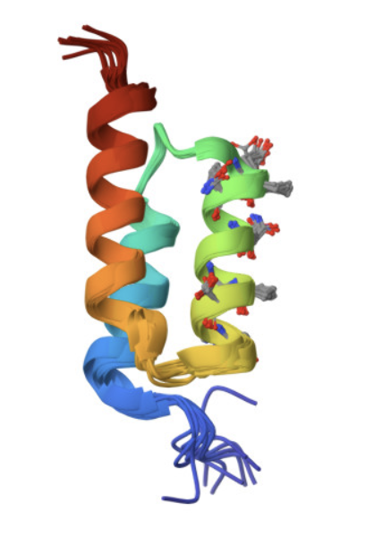
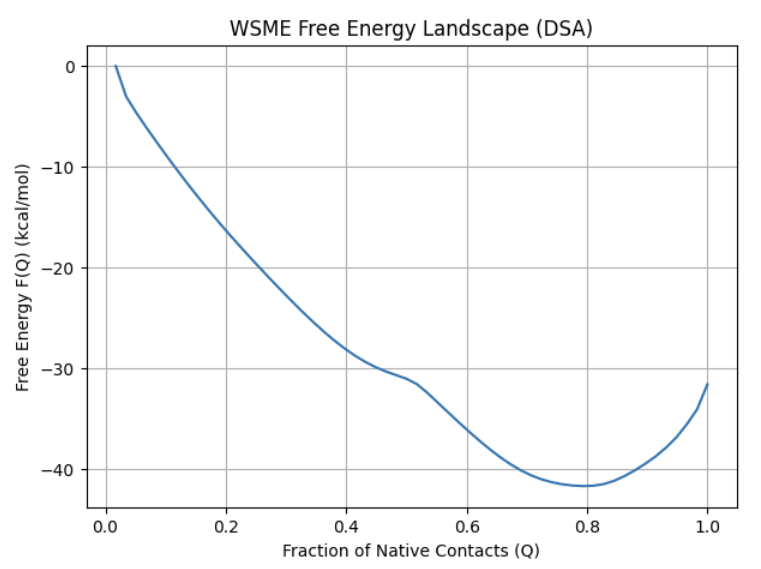

# WSME-C++ Python Wrapper

This repository provides a Python interface to a C++ implementation of the Wako-Saitô-Muñoz-Eaton (WSME) model, a physics-based approach for predicting protein folding energy landscapes. The model is useful for computational biology, bioinformatics, and statistical modeling related to protein folding, contact maps, and thermodynamic partition functions.

The wrapper is built using `pybind11`, enabling seamless integration between Python and C++ for high-performance computing.

For a detailed description of the WSME model, refer to [this review](https://www.mdpi.com/1420-3049/27/14/4460)


<div style="display: flex; align-items: center;">
    
    
</div>


## Theoretical Foundation: WSME Model

The WSME model is a coarse-grained statistical mechanical approach that describes protein folding as a cooperative process. It assumes that:

- Each residue in the protein exists in either a native-like or unfolded state.

- Native interactions contribute to stability only if all intervening residues between contacting pairs are folded.

- Folding is driven by a balance between enthalpic stabilization (native contacts) and entropic penalties (loss of conformational freedom).

The **Hamiltonian** of the WSME model is given by:

$\hspace{4cm} H(\{m\}) = \sum_{i<j} \epsilon_{ij} \Delta_{ij} m_{i,j}$

where:
- $\epsilon_{ij}$ is the contact energy for residue pair $(i,j)$,
- $\Delta_{ij}$ is 1 if residues $i$ and $j$ are in contact in the native state, otherwise 0,
- $m_{i,j}$ represents cooperative folding, meaning contacts contribute only when all intermediate residues are folded.

The **partition function** is computed as:

$\hspace{4cm}  Z = \sum_{\{m\}} W(\{m\}) e^{-\beta H(\{m\})}$

where $\beta = \frac{1}{k_B T}$ (Boltzmann factor), and $W(\{m\})$ represents the entropy of the system. The partition function  sums over all conformational states of the system. However, in the WSME model, we group conformations are based on their fraction of native contacts $Q$:

$\hspace{4cm}  Z(Q) = \sum_{\{m \mid Q(m) = Q\}} W(m) e^{-\beta H(m)}$,

where $Z(Q)$ is the restricted partition function that considers only states with a specific fraction $Q$ of native contacts.

Under this assumption, the **free-energy landscape** as function of the partition function $Z$ is then derived from the **Helmholtz free energy**:

$\hspace{4cm} F(Q) = - k_B T \ln \frac{Z(Q)}{Z_{\text{total}}}$

where the scaled $\frac{Z(Q)}{Z_{\text{total}}}$ represents the probability of finding the system in a state with a specific native contact fraction $Q$.

## Installation

To use the WSME wrapper, you need to set up the following dependencies:

### Prerequisites
- Python Python 3.9
- pybind11 (for creating Python bindings)
- C++ compiler (tested with Clang, GCC)

### Install Dependencies

1. Clone the repository:

    ```
    git clone https://github.com/aleromualdi/WSME-cpp
    cd WSME-cpp
    ```

2. Install the necessary C++ build tools:

    On macOS, you can use brew:
    
    ```
    brew install cmake llvm
    ```

3. Build the C++ extension using setup.py:

    ```
    python setup.py build_ext --inplace
    ```

    This will compile the C++ code and create a Python extension module that you can import directly in Python.


##  Usage

After installing the wrapper, you can import the compiled module, which implements the computation of the partition function, into your Python script and use it like any other Python function.

For a complete workflow on how to compute the free energy landscape for the `7urj.pdb` protein, refer to the example in `wsme.py`
.

